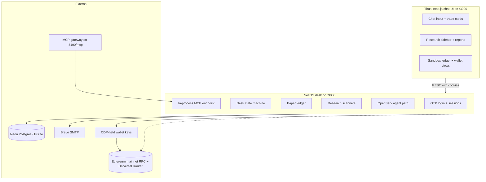

# Arena 67


**Your orders. Your confirmation. The wallet stays closed until you say so.**

Trading desks are built around execution speed, and every speed shortcut is a
place a wallet can leak. Arena 67 takes the opposite premise: a language model
reads your intent, the desk prices it, and execution happens only through one
confirm gate that you approve in plain language.

Live: https://agent67desk.work · API: https://api.agent67desk.work · Trades settle on ethereum mainnet via the CDP-held wallet.

[See it in one command](#see-it-in-one-command) · [The one rule](#the-one-rule) · [What Arena 67 does](#what-arena-67-does) · [Architecture](#architecture) · [Safety, enforced in code](#safety-enforced-in-code) · [Tests](#tests)

Built as a hackathon project for the agentic trading-desk track and released
under the license declared in the repository.
It is not financial advice and it is not a custodial service. Funds stay in the
account's own wallet, and the desk only moves them on an explicit confirmation.

## Table of Contents

- [See it in one command](#see-it-in-one-command)
- [Screenshots](#screenshots)
- [The one rule](#the-one-rule)
- [What Arena 67 does](#what-arena-67-does)
- [Architecture](#architecture)
- [Component by component](#component-by-component)
- [Safety, enforced in code](#safety-enforced-in-code)
- [How it uses ethereum](#how-it-uses-ethereum)
- [Engineering decisions and the hard problems](#engineering-decisions-and-the-hard-problems)
- [What is real vs pending - the honesty table](#what-is-real-vs-pending---the-honesty-table)
- [Tests](#tests)
- [Run it locally](#run-it-locally)
- [The one-flow demo](#the-one-flow-demo)
- [Configuration](#configuration)
- [Deploy](#deploy)
- [Project layout](#project-layout)
- [Tech stack, credits, roadmap](#tech-stack-credits-roadmap)
- [Disclaimer and license](#disclaimer-and-license)

## See it in one command

Backend (NestJS desk on port 9000):

```bash
cd apps/arena-67-backend
cp .env.example .env
npm install
npm run start:dev
```

Frontend (Next.js chat UI on port 3000):

```bash
cd apps/arena-67-ui
cp .env.example .env.local
npm install
npm run dev
```

After both are running, open http://localhost:3000 and log in with any email
address. With SMTP configured a 6-digit code is emailed; without it the code is
printed to the backend log. A fresh account starts in sandbox mode, so the
whole trade flow is safe to click through before anything real is on the line.

## Screenshots

Screenshot capture of the live app at https://agent67desk.work is still
pending. The captures below will cover the three surfaces that matter most:

- Dashboard with the chat input and the account's mode and balance.
- Trade flow with a quote card and the confirm gate.
- Research panel with trending addresses and a token report.

## The one rule

*Nothing in the wallet moves until the user confirms the exact order.*

The rule is enforced in three layers:

1. **Data layer.** Pending intents live in a server-side store keyed by session.
   Intent ids, candidate ids, and quote ids are opaque, so a card returned to
   the UI can never be back-fed as an address. Quotes are short-lived (TTL) and
   bound to the session that created them.
2. **Wallet layer.** Private keys are encrypted at rest with
   `WALLET_ENCRYPTION_KEY` (dev uses the `_DEV` twin), and signing is delegated
   to the Coinbase CDP-held signer built from `CDP_WALLET_SECRET`. No key
   material is reachable from the frontend or the MCP gateway.
3. **Execution layer.** `claimForExecution` on the pending-intent store is
   idempotent, so a double confirm cannot fire two swaps.
   `MAX_TRADE_USD` caps the dollar size and `MAX_SLIPPAGE_BPS` caps the fill
   distance. The backend refuses to hide which network it is on and logs
   `network=mainnet chain=4663 funds=REAL` at boot.

## What Arena 67 does

### Log in with your email

The app uses magic codes, not passwords. `POST /auth/code` emails a 6-digit
code through Brevo SMTP (or prints it in dev), and `POST /auth/verify` swaps it
for an HttpOnly session cookie pair with JWT refresh.

```text
email -> OTP code -> verify -> session cookies -> /auth/me
```

What makes it real: a live OTP has been emailed to a real inbox and verified
end to end on the deployed server.

### The trading desk

A state machine that a language model walks one step at a time:

```text
begin -> select-token -> amount -> select-pool -> requote -> confirm
```

Every step is a separate authenticated endpoint under `JwtAuthGuard`, and only
the confirm step can move funds. The flow re-prices at the last moment, and a
quote is never valid beyond its TTL.

### Research that does the reading

`GET /research/trending` and `GET /research/new-tokens` scan the live network,
and the analysis endpoints build per-token reports, live quotes, holder lists,
and holder-overlap breakdowns (`/common-holders`), plus a transfer-fold view of
where a token's supply moved last.

```text
research/trending -> pick a token -> research/tokens/:address/report
```

### Sandbox mode

Every new account defaults to sandbox. The paper ledger takes deposits and
tracks trades with the same state machine, so the entire desk can be exercised
against fake money before a single real order.

### Memory

Conversations are persisted and recallable (`GET /memory/recall`), so a logged-in
user can ask about a decision from last week and the desk can re-read the
thread that led to it.

### An optional LLM agent path

`POST /agent/chat` wires the OpenServ SDK into the same cleared-flow pipes, so
an external LLM can drive the desk subject to the same confirm gate.

### An MCP server

The repo ships `apps/arena-67-mcp`, an HTTP MCP server on port 5100 that
exposes the desk's research and trading tools over `/mcp`. It is gated by a
bearer token (`MCP_TOKEN`) and authenticates to the backend with
`SERVICE_SECRET` before forwarding anything.

## Architecture

Two key decisions drive the shape of the system:

- **The confirm gate is the only place money moves.** Every other component is
  read-only by construction: research scanners, the LLM, the sandbox, the MCP
  gateway. There is exactly one execution entry point.
- **Mainnet boots, sandbox protects.** The backend always boots against the
  real network and advertises `funds=REAL`, so there is no silent testnet
  build. But each *account* defaults to sandbox, so the real wallet only opens
  when the user chooses and confirms.



Process model:

| Tier | Runs | Can it move funds? | Responsibility |
| --- | --- | --- | --- |
| Research scanners | Backend, on schedule and on demand | No | Surface trending and new token candidates |
| Desk + LLM | Reads intent, prices, requotes | No | Turn plain language into a confirmable order |
| Sandbox ledger | Paper deposits and trades | No (fake money) | Let users rehearse the flow safely |
| Confirm gate | Single execution entry point | Yes, one order per claim | Execute a confirmed quote with caps |
| CDP signer | Backend, TEE-held | Yes, only when the gate signs | Attest and broadcast the swap |

## Component by component

| Layer | Piece | Responsibility |
| --- | --- | --- |
| Backend | `modules/accounts` | Per-user wallets, balance, portfolio, trade history, wallet export |
| Backend | `modules/auth` | OTP codes, verify, refresh, logout, `me` |
| Backend | `modules/trading` | The `begin -> confirm` state machine and quote store |
| Backend | `modules/sandbox` | Account mode and the paper ledger |
| Backend | `modules/research` | Trending, new-tokens, sidebar signals |
| Backend | `modules/analysis` | Token reports, holders, transfers, common-holders |
| Backend | `modules/tokens` | Token search and index lookups |
| Backend | `modules/memory` | Conversations and recall |
| Backend | `modules/database` | Drizzle schema over `DATABASE_URL` or PGlite |
| Backend | `modules/mail` | Nodemailer delivery of OTP codes |
| Backend | `modules/crypto` | Encrypted wallet-key storage |
| UI | `apps/arena-67-ui` | Chat interface, trade cards, research, dashboard |
| MCP | `apps/arena-67-mcp` | Token-gated HTTP gateway exposing desk tools |

## Safety, enforced in code

| Claim | How it is enforced |
| --- | --- |
| Email codes, not passwords | OTP generated server-side, delivered by SMTP, exchanged for cookies |
| Keys never reach the browser | Encrypted at rest, signing delegated to the CDP signer |
| A card can't steer execution | Opaque intent/candidate/quote ids resolved server-side |
| Double confirm can't double spend | `claimForExecution` is idempotent |
| A stale quote can't execute | Quote TTL binding the quote to its session and age |
| Trade size and slippage are capped | `MAX_TRADE_USD`, `MAX_SLIPPAGE_BPS` |
| Sessions are tied to their owner | Pending-intent store keyed by session, `JwtAuthGuard` on `/trade/*` and `/wallet/*` |
| MCP can't impersonate a user | `MCP_TOKEN` bearer gate plus `SERVICE_SECRET` backend identity |
| No silent testnet | Boot logs `network=mainnet chain=4663 funds=REAL` |

## How it uses ethereum

**Reads.** Token search and indexing, holder and transfer scanning, live token
reports, and RPC-side pricing all read through `viem` on the configured RPC.

**Writes.** There is exactly one writer: the confirmed trade, executed through
the Uniswap Universal Router with Permit2 using the CDP-held signer keyed by
`CDP_WALLET_SECRET`. The project deploys no contracts of its own - it is a
client of existing onchain routes.

**Limits vs spending.** The writer path is capped per trade (`MAX_TRADE_USD`)
and per fill (`MAX_SLIPPAGE_BPS`), and every broadcast requires the confirm
gate. On a live network a confirmed trade moves real funds, which is exactly
why the standing rule is: no live broadcast without explicit user
authorization.

## Engineering decisions and the hard problems

- *Cookie sessions over bearer tokens.* OTP-verified sessions ride in HttpOnly
  cookies, so the token never exists in JavaScript memory. The `Secure` flag
  is only set in production, now that Caddy terminates TLS in front of the
  backend.
- *Opaque ids over card-carried addresses.* The biggest failure mode in agentic
  trading is a UI card that carries a pool address back into execution. The
  desk resolves everything server-side, so the UI is structurally unable to
  steer the trade to a pool the desk did not chose.
- *Sandbox by default on a mainnet boot.* New accounts rehearse on paper while
  the desk still boots against the real chain. The trade-off is that a real
  trade also needs the funds and the confirm, which is the point.
- *_DEV split on encrypted keys.* A dev machine can never decrypt a production
  wallet, because production requires the bare `WALLET_ENCRYPTION_KEY` and dev
  only ever reads the `_DEV` twin. It costs one more env var and buys a whole
  class of key leakage.
- *Postgres when present, PGlite otherwise.* The app boots with zero external
  services in dev, then runs full migrations on `DATABASE_URL` (Neon in
  production). The same Drizzle schema serves both.
- *Email codes over magic links.* A 6-digit code expires fast and carries no
  session state. In dev the code falls back to the backend log so local setup
  needs no mail provider.
- *A real-funds guard at boot.* The backend asserts and logs its network state
  instead of silently testing. If the production key is missing in production
  mode, the wallet service fails closed rather than degrading.

## What is real vs pending - the honesty table

| Capability | Status |
| --- | --- |
| Email OTP login | Real - Brevo SMTP verified, a live code emailed and verified on the VPS |
| Session auth and cookie refresh | Real - E2E on the server |
| Trading desk state machine | Real - full `begin -> confirm` flow green end to end |
| CDP-held agent wallet | Real - boot asserts network and chain, wallet address returned by `/trade/wallet` |
| Confirmed mainnet swap | Not yet established - gated behind explicit user authorization by standing rule |
| Sandbox paper ledger | Real - deposits, mode switching, and ledger math covered by tests |
| Research scanners | Real - trending/new-tokens served from the live deployment |
| Memory and conversations | Real |
| MCP gateway on :5100 | Real - token-gated, `inboundAuth: true` verified |
| Postgres migrations on Neon | Real - applied at boot on the VPS |
| Wallet export flow | Endpoints exist (`POST /wallet/export/code`, `POST /wallet/export`); not yet exercised E2E |
| Domain with TLS | Real - agent67desk.work behind Caddy with Let's Encrypt |
| Screenshots | Not yet established - capture pending |
| CI test runs | Not yet established - tests run from the CLI |

## Tests

| Suite | Count | Covers |
| --- | --- | --- |
| `trading.service` | 28 | Amount validation, USD cap, funding, quote-then-confirm, double-confirm no-op, offline behavior |
| `wallet-key.service` | 12 | Encryption, dev/prod key split, authentication failures |
| `tokens.transport` | 12 | Token search and index transport |
| `pending-intent.store` | 11 | Opaque ids, session ownership, TTL, idempotent claim, sweep |
| `transfer-fold` | 11 | Transfer clustering and fold logic |
| `report.signals` | 10 | Signal generation in token reports |
| `paper-ledger` | 8 | Sandbox deposit, reset, ledger math |
| `connection-errors` | 7 | Database and RPC failure handling |
| `rpc-limiter` | 5 | Per-route RPC throttling |
| `research.new-tokens` | 3 | New-token scanner |
| `history` | 3 | Trade and transfer history |
| `transfer-tax` | 3 | Fee and tax handling on transfers |

Run them:

```bash
cd apps/arena-67-backend
npm test
```

Backend status: 12 suites, 113 tests passing.
Frontend status: no test suite yet - guarded by `next build` and `eslint`.

## Run it locally

### 1. Backend

```bash
cd apps/arena-67-backend
cp .env.example .env
npm install
npm run start:dev
```

The desk listens on port 9000. Without `DATABASE_URL` it uses an embedded
PGlite; with one it runs the migrations against that Postgres.

### 2. Frontend

```bash
cd apps/arena-67-ui
cp .env.example .env.local
npm install
npm run dev
```

The UI talks to `http://localhost:9000` by default. Point it elsewhere with
`NEXT_PUBLIC_API_URL`.

### 3. MCP server

```bash
cd apps/arena-67-mcp
cp .env.example .env
npm install
npm run dev
```

The MCP server listens on port 5100 and serves the desk's tool surface at
`/mcp`. Leave `MCP_TOKEN` unset for open local access, or set a bearer token
to gate it.

## The one-flow demo

1. Open the frontend and log in with an email, then enter the emailed code.
2. Confirm the account is in sandbox mode and note the paper balance.
3. Ask for a trade in plain language - the desk begins an intent, searches the
   token, and prices a candidate amount.
4. Review the quote card and confirm it - the paper ledger reflects the trade.
5. Open research, pick a trending address, and run the token report.
6. Switch the account to the real network and repeat the flow, stopping at the
   confirm gate. Broadcasting a live order still requires explicit
   authorization.

The whole demo up to step 5 runs on fake money and needs no funding.

## Configuration

### Backend (`apps/arena-67-backend/.env`)

| Variable | Purpose |
| --- | --- |
| `ARENA_NETWORK` | `mainnet` (4663, real funds, default) or `testnet` (46630) |
| `RPC_URL` | Override the network RPC endpoint |
| `MAX_TRADE_USD` | Per-trade dollar cap (default `25`) |
| `MAX_SLIPPAGE_BPS` | Slippage tolerance on quote fills (default `300`) |
| `ENABLE_OPENSERV_AGENT` | When `true`, wires the OpenServ agent into the desk |
| `OPENSERV_AI_API_KEY` | OpenServ SDK key, needed only for the agent path |
| `CDP_API_KEY_ID` / `CDP_API_KEY_SECRET` | Coinbase CDP API credentials |
| `CDP_WALLET_SECRET` | The encrypted CDP wallet secret |
| `AGENT_ACCOUNT_NAME` | Name to use for the agent account (default `arena67-agent`) |
| `SERVICE_SECRET` | Shared secret that lets the backend identify its own services |
| `JWT_SECRET` | Signs session and per-turn tokens |
| `WALLET_ENCRYPTION_KEY` / `WALLET_ENCRYPTION_KEY_DEV` | Master key for wallet keys; production requires the bare variable |
| `DATABASE_URL` | Postgres connection string; unset uses PGlite |
| `SMTP_HOST` / `SMTP_PORT` / `SMTP_USER` / `SMTP_PASSWORD` | SMTP delivery for OTP codes |
| `SMTP_FROM_EMAIL` | From address shown on emails |
| `SMTP_SECURE` | Whether to use TLS on the SMTP port |
| `CORS_ORIGIN` | Browser origin the dashboard is served from; required at boot |
| `PORT` | Listening port (default `9000`) |

### Frontend (`apps/arena-67-ui/.env.local`)

| Variable | Purpose |
| --- | --- |
| `NEXT_PUBLIC_API_URL` | Backend base URL the UI calls |

### MCP (`apps/arena-67-mcp/.env`)

| Variable | Purpose |
| --- | --- |
| `API_URL` / `API_URL_DEV` | Backend URL the gateway forwards to |
| `SERVICE_SECRET` | Backend identity secret, must match the backend |
| `PORT` | Listening port (default `5100`) |
| `MCP_PATH` | Path the MCP server is served on (default `/mcp`) |
| `MCP_TOKEN` | Bearer token callers must present; unset means open |

## Deploy

The production target is a single VPS (Ubuntu 24.04) managed with pm2.

```bash
pm2 start ecosystem.config.cjs
pm2 save
pm2 startup   # installs the systemd unit so services survive reboots
```

The ecosystem file runs three apps: `arena67-backend` on :9000, `arena67-ui`
on :3000, and `arena67-mcp` on :5100. Each app reads its own `.env` from its
app directory.

Reference values from the live deployment:

- `NODE_ENV=production` is set on the backend; Secure cookies are served
  because Caddy terminates TLS on the `api` subdomain.
- `MCP_TOKEN` and `WALLET_ENCRYPTION_KEY` are set; keep both out of version
  control and treat the wallet key like a credential.
- The domain is live: `agent67desk.work` and `app.agent67desk.work` proxy to
  the UI on :3000, and `api.agent67desk.work` to the backend on :9000, all
  behind Caddy with Let's Encrypt. The UI was rebuilt with
  `NEXT_PUBLIC_API_URL=https://api.agent67desk.work`, and `CORS_ORIGIN`
  reflects the HTTPS origins.

## Project layout

```text
apps/
  arena-67-backend/          # NestJS desk on :9000
    src/
      modules/
        accounts/            # user wallets, balance, portfolio, export
        agent/               # OpenServ agent path
        analysis/            # per-token reports, holders, transfers
        auth/                # OTP login + cookie sessions
        crypto/              # encrypted wallet-key storage
        database/            # Drizzle schema, Postgres or PGlite
        mail/                # SMTP delivery of codes
        memory/              # conversations and recall
        research/            # trending, new-tokens, sidebar
        sandbox/             # paper ledger + account mode
        tokens/              # token search and index
        trading/             # begin -> confirm state machine
    test/                    # e2e setup
  arena-67-mcp/              # HTTP MCP gateway on :5100/mcp
  arena-67-ui/               # Next.js 16 chat UI on :3000
  ui/                        # @repo/ui shared design tokens
ecosystem.config.cjs         # pm2 process definition for the VPS
package.json                 # workspace root, engines, turbo
```

## Tech stack, credits, roadmap

### Tech stack

Next.js 16 and React 19 for the UI, NestJS 11 for the desk, viem for RPC and
the Uniswap Universal Router for settlement, Coinbase CDP and AgentKit for the
held signer, Drizzle ORM over Neon Postgres (with a PGlite fallback), Nodemailer
with Brevo for codes, the OpenServ SDK for the agent path, and the MCP SDK for
the tool gateway. The workspace runs on Turborepo with a pinned Node 24
engine.

### Credits

Arena 67 is built and deployed by its team as a hackathon project for
the agentic trading-desk track. The repository lives under
`Knowledge-JO/arena-8004`.

### Roadmap

- Purchase a domain, terminate TLS at a reverse proxy, and flip production
  cookies to Secure.
- Move the production wallet key out of `.env` into a KMS and make that the
  only accepted source.
- Exercise the wallet export flow end to end and capture screenshots for this
  README.
- Add a CI pipeline that runs the 113 backend tests on every push.
- Walk one real confirmed trade through the gate with explicit user
  authorization, and record the receipts as proof.

## Disclaimer and license

Arena 67 is a demonstration trading desk. It is not financial advice, it is
not an investment product, and it is not a custodial or broker service. Money
on a live network moves only through your explicitly confirmed orders, and you
are responsible for the trades you authorize. Nothing in this repository
guarantees any outcome, and past performance of any tested flow means nothing
for future trades.

No LICENSE file is present in the repository, and the workspaces declare
`UNLICENSED`. Contact the repository owners before using or redistributing any
part of it.